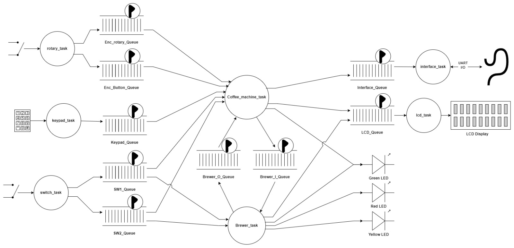
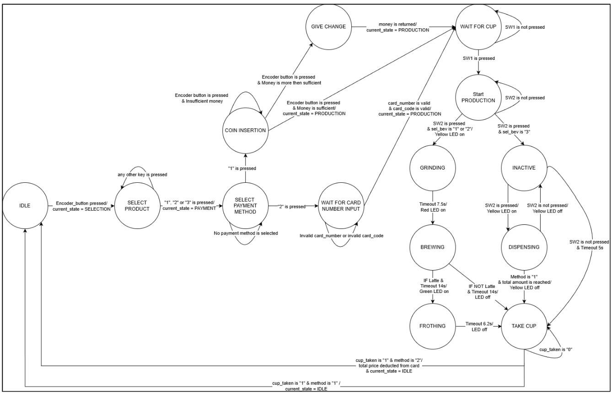

# ☕ Coffee Vending Machine with FreeRTOS

## Overview

This project was developed as the final assignment for the **Embedded Programming** course at the **University of Southern Denmark (SDU)**.

The objective was to design and implement a **coffee vending machine controller using FreeRTOS**. The system integrates multiple input/output peripherals and uses FreeRTOS objects for **inter-task communication, synchronization, and shared-resource management**.

The coffee machine supports three products — **Espresso, Latte, and Filter Coffee** — and handles the complete vending process from product selection and payment to beverage production and transaction logging.

---

## System Requirements

The coffee vending machine consists of:

- Grinder
- Brewer
- Milk frother
- Display
- Keypad
- Digital rotary encoder
- Cup detection and start switches
- Status LEDs
- UART interface

### Available Products

| Product | Default Price |
|---|---:|
| Espresso | 15 DKK |
| Latte | 27 DKK |
| Filter Coffee | 3 DKK/cl |

---

## System Workflow

The overall vending process follows the sequence:

1. **Product Selection**
2. **Payment**
3. **Cup Detection**
4. **Production**
5. **Completion**
6. **Transaction Logging**

The system behavior is managed using a **Finite State Machine (FSM)**, while individual hardware and application functions are separated into multiple **FreeRTOS tasks**.

---

## Payment System

The machine supports two payment methods.

### Cash Payment

Only **5 DKK** and **20 DKK** coins are accepted.

Coin insertion is simulated using the rotary encoder:

- Counter-clockwise rotation → **5 DKK**
- Clockwise rotation → **20 DKK**

For Espresso and Latte, change is returned in 1 DKK units and represented by flashing the **green LED once per 1 DKK**.

Filter Coffee does not provide change because its final price depends on the amount dispensed.

### Card Payment

Card payment requires:

- **16-digit card number**
- **4-digit PIN**

Payment is accepted when the card number and PIN satisfy the parity validation rule:

- Odd card number + Odd PIN → Accepted
- Even card number + Even PIN → Accepted
- Odd + Even → Rejected
- Even + Odd → Rejected

---

## Coffee Production

Production begins only after:

1. Payment has been completed.
2. A cup is placed under the dispenser.
3. The start button is pressed.

Cup presence is simulated using **SW1**, while production is started using **SW2**.

If the start button is pressed without a cup, the system displays an instruction requesting the user to place a cup.

### Espresso

Production sequence:

1. Grind coffee for **7.5 seconds** — Yellow LED
2. Brew coffee for **14 seconds** — Red LED

### Latte

Production sequence:

1. Grind coffee for **7.5 seconds** — Yellow LED
2. Brew coffee for **14 seconds** — Red LED
3. Froth milk for **6.2 seconds** — Green LED

### Filter Coffee

Filter coffee is dispensed while the start button is pressed or until the prepaid amount is reached.

Dispensing rate:

- First 3 seconds → **0.6 cl/s**
- After 3 seconds → **1.45 cl/s**

Additional coffee can be dispensed by repeatedly pressing the start button.

If no additional input is received for **5 seconds**, dispensing is considered complete.

During dispensing, the display shows:

- Dispensed amount
- Unit price
- Total price

After production is complete, the user is notified until the cup is removed.

---

## FreeRTOS Architecture

The project uses **FreeRTOS** to separate hardware input handling, system control, display management, logging, and other functions into independent tasks.

FreeRTOS queues are used to exchange events and data between tasks.

### Main Queues

```c
xEnc_rotary_Queue
xEnc_Button_Queue
xKeypad_Queue
xLCD_Queue
xSW1_Queue
xSW2_Queue
xUART_Queue
xState_Queue
xLogging_Queue
xProduct_queue
```

---

### Task Architecture

The system is divided into multiple FreeRTOS tasks, with queues used for inter-task communication and event handling.



### State Machine

The overall coffee vending process is controlled using a Finite State Machine (FSM), managing transitions between product selection, payment, production, and completion.


